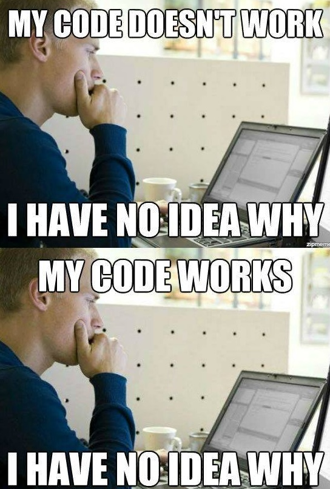

# Day 30. `Easy` 手寫 Promise.race

## 🔸 題目描述

`Promise.race()` 是在 JavaScript 中一個非常實用的 Promise 方法，它可以讓我們同時執行多個非同步操作，並傳回最先完成的操作的結果或錯誤原因。請手寫實踐 `Promise.race()` 方法。


## 💭 理解題目

首先，先看一下 MDN 定義什麼是 [Promise.race](https://developer.mozilla.org/en-US/docs/Web/JavaScript/Reference/Global_Objects/Promise/race)，最基本的範例：


```javascript
const promise1 = new Promise((resolve, reject) => {
  setTimeout(resolve, 500, 'one');
});

const promise2 = new Promise((resolve, reject) => {
  setTimeout(resolve, 100, 'two');
});

Promise.race([promise1, promise2]).then((value) => {
  console.log(value);
  // Both resolve, but promise2 is faster
});
// Expected output: "two"
```


在上面這段範例中，雖然兩個 promise 最後都會被 resolve，但在 `Promise.race` 的作用下，會先去實現或拒絕最快被完成的 promise，因此在這個範例下， promise2 的 100ms 會更先被完成，所以最後會得到印出結果 `two`。


## 📜 單元測試

由於這個 utility 比較複雜一些，先列出可能要顧及到的 test-cases 並寫成對應的單元測試：

- 傳入 2 個都會成功的 promise 時，能回傳最快被 resolve 的
- 傳入 1 個成功、1 個失敗的 promise 時，能實現或拒絕那個更快被完成的
- 傳入多個 promise，能正確得到最快被完成的 promise 的值
- edge cases：傳入空陣列應防呆


在單元測試中為了避免寫一堆 `setTimeout` 這裡利用第 29 題中的 `sleep` 稍微改寫一下：


```typescript
import { PROMISE_STATE } from './enum';

interface SleepParams<T> {
  duration: number;
  value: T;
  state: PROMISE_STATE;
}

const sleep = <T>({ duration, value, state }: SleepParams<T>): Promise<T> =>
  new Promise((resolve, reject) =>
    setTimeout(() => {
      if (state === PROMISE_STATE.FULFILLED) {
        resolve(value);
      } else {
        reject(value);
      }
    }, duration)
  );

export default sleep;
```


可以寫出最基本的 unit test 如下：


```typescript
import { describe, expect, it } from 'vitest';
import promiseRace from './promiseRace';
import sleep from './sleep';
import { PROMISE_STATE } from './enum';

const fastPromiseParams = {
  duration: 100,
  value: 'fast',
  state: PROMISE_STATE.FULFILLED,
};
const slowPromiseParams = {
  duration: 500,
  value: 'slow',
  state: PROMISE_STATE.FULFILLED,
};

it('basic: resolve with the faster promise', async () => {
  const fastPromise = sleep({ ...fastPromiseParams });
  const slowPromise = sleep({ ...slowPromiseParams });
  const result = await promiseRace([fastPromise, slowPromise]);

  expect(result).toBe('fast');
});
```


詳細的 test-cases 單元測試可見 [promiseRace.test.ts](./promiseRace.test.ts)。


## 💭 分析與思路

1. 首先先整理題目要的輸入與輸出，分別是一個 promise array 及輸出一個 promise：

```typescript
export default function promiseRace<T>(promises: Promise<T>[]): Promise<unknown> {
  // write your code here
}
```


這裡剛好我是用 TypeScript 方便做定型，可以看到為了保留彈性，用了泛型來讓傳入的 promise array 的回傳值可以是各種型別，並且在輸出值中，因為可能會有 error 的產出，先定義為 unknown。


2. 回傳值期待是個 promise，先把樣子寫出來：

```typescript
export default function promiseRace<T>(promises: Promise<T>[]): Promise<unknown> {
  return new Promise((resolve, reject) => {
    // handle promise array here
  })
}
```


3. 最後是處理 promise array 的邏輯，而因為這裡是只要管「第一個被完成」的就好，所以就嘗試性地跑個迴圈讓他們全部自由的同步去執行，誰最快執行完成就能搶到第一個使用 `resolve` 或 `reject` 的權限：

```typescript
export default function promiseRace<T>(promises: Promise<T>[]): Promise<unknown> {
  return new Promise((resolve, reject) => {
    promises.forEach((p) => {
      p.then((res) => resolve(res)).catch((error) => reject(error));
    });
  });
}
```


4. 雖然不確定概念對不對，但反正跑過 unit test all pass 看來是成功了，看起來前一點的概念是正確的，最後再補上一些防呆就大功告成：

```typescript
export default function promiseRace<T>(promises: Promise<T>[]): Promise<unknown> {
  if (!promises.length) {
    throw new Error('No promise was passed');
  }

  return new Promise((resolve, reject) => {
    promises.forEach((p) => {
      p.then((res) => resolve(res)).catch((error) => reject(error));
    });
  });
}
```




5. 完成後去對答案看到除了可以統一改寫成 async/await 外，看到有更簡潔的版本，最後這個 `then(resolve, reject)` 還在理解中，先留個筆記 ：

```javascript
function promiseRace(promises) {
  return new Promise((resolve, reject) => {
    if (promises.length === 0) {
      return
    }

    promises.forEach((item) =>
      Promise.resolve(item).then(resolve, reject));
  })
}
```
