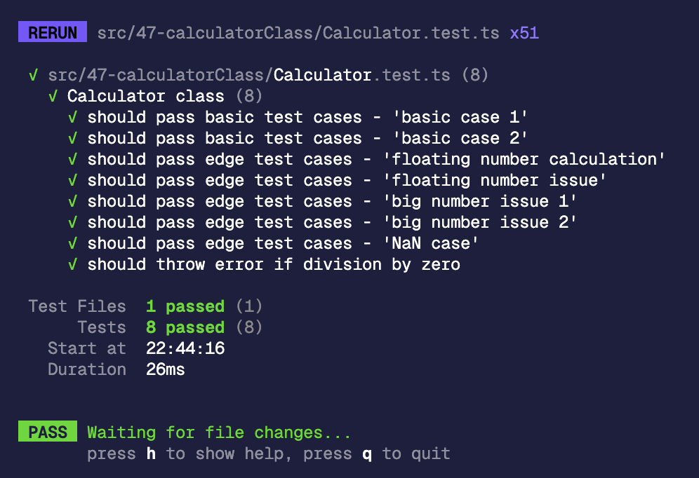

# 47. `Easy` Calculator with Method Chaining (加減乘除計算機)

## 🔸 題目描述

請設計一個 `Calculator` 類別。該類別具有 add(加法)、subtract(減法)、multiply(乘法)、divide(除法)和 power(次方) 等數學運算功能。同時，還會支援連續操作的方法鍊式 (method chaining)。 `Calculator` 類別的建構式會接受一個數字，來作為 `result` 的初始值。

具體來說，`Calculator` 類別應包含以下方法：

- `add` 將給定的數字 `value` 與 `result` 相加，並回傳更新後的`Calculator` 物件
- `subtract` 從 `result` 中減去給定的數字 `value` ，並回傳更新後的`Calculator` 物件
- `multiply` 將 `result` 乘以給定的數字 `value`，並回傳更新後的 `Calculator` 物件
- `divide` 將 `result` 除以給定的數字 `value`，並回傳更新後的 `Calculator` 物件。如果傳入的值為 `0`，則拋出錯誤 `"Division by zero is not allowed"`
- `power` 計算 `result` 的次方，指數為給定的數字 `value`，意即 `result = result ^ value`。在計算完後，回傳更新後的 `Calculator` 物件。
- `getResult` 傳回 `result`的值

```javascript
// 範例 1：
輸入： actions = ["Calculator", "add", "subtract", "getResult"],
值 = [10, 5, 7]
輸出： 8
解釋：
new Calculator(10).add(5).subtract(7).getResult() // 10 + 5 - 7 = 8

// 範例 2：
輸入： actions = ["Calculator", "multiply", "power", "getResult"],
值 = [2, 5, 2]
輸出： 100
解釋：
new Calculator(2).multiply(5).power(2).getResult() // (2 * 5) ^ 2 = 100
```

## 💭 分析與思路

### 問題釐清

- 是否須處理沒有初始值的狀況
- 是否需處理浮點數精度的問題
- 是否需處理大數運算

### 提出測試案例

- 確認基本測資的運算鏈能正常運作
- 確認 `divide(0)` 是否能正確拋出錯誤訊息
- 確認浮點數精度問題
- 確認大數運算問題

### 提出思路

定義相對明確的題目，就是用 class 實作一個計算機類別，需注意的有 2 點：
- divide 的防呆
- 運算的幾個函式要能回傳當前的 instance

### 實作

```ts
export enum ACTION_ENUM {
  ADD = 'add',
  SUBTRACT = 'subtract',
  MULTIPLY = 'multiply',
  DIVIDE = 'divide',
  POWER = 'power',
  GET_RESULT = 'getResult',
}

export default class Calculator {
  private result: number;

  constructor(initialValue: number) {
    this.result = initialValue;
  }

  add(value: number) {
    this.result += value;

    return this;
  }

  subtract(value: number) {
    this.result -= value;

    return this;
  }

  multiply(value: number) {
    this.result *= value;

    return this;
  }

  divide(value: number) {
    if (value === 0) {
      throw new Error('Division by zero is not allowed');
    }

    this.result /= value;

    return this;
  }

  power(value: number) {
    this.result **= value;

    return this;
  }

  getResult() {
    return Number(this.result.toFixed(1));
  }
}
```

另外補上單元測試：

```ts
import { describe, expect, test } from 'vitest';
import Calculator, { ACTION_ENUM } from './Calculator';

const testCases = [
  {
    title: 'basic case 1',
    actions: [ACTION_ENUM.ADD, ACTION_ENUM.SUBTRACT, ACTION_ENUM.GET_RESULT],
    initialValue: 10,
    values: [5, 7],
    expected: 8,
  },
  {
    title: 'basic case 2',
    actions: [ACTION_ENUM.MULTIPLY, ACTION_ENUM.POWER, ACTION_ENUM.GET_RESULT],
    initialValue: 2,
    values: [5, 2],
    expected: 100,
  },
  {
    title: 'floating number calculation',
    actions: [
      ACTION_ENUM.MULTIPLY,
      ACTION_ENUM.POWER,
      ACTION_ENUM.DIVIDE,
      ACTION_ENUM.GET_RESULT,
    ],
    initialValue: 9,
    values: [13, 5, 11],
    expected: 1993134577.9,
  },
  {
    title: 'floating number issue',
    actions: [ACTION_ENUM.ADD, ACTION_ENUM.GET_RESULT],
    initialValue: 0.1,
    values: [0.2],
    expected: 0.3,
  },
  {
    title: 'big number issue 1',
    actions: [ACTION_ENUM.MULTIPLY, ACTION_ENUM.POWER, ACTION_ENUM.GET_RESULT],
    initialValue: 999999,
    values: [999999, 999999],
    expected: Infinity,
  },
  {
    title: 'big number issue 2',
    actions: [ACTION_ENUM.MULTIPLY, ACTION_ENUM.POWER, ACTION_ENUM.GET_RESULT],
    initialValue: Number.MAX_SAFE_INTEGER,
    values: [Number.MAX_SAFE_INTEGER, 2],
    expected: 6.582018229284821e63,
  },
  {
    title: 'NaN case',
    actions: [
      ACTION_ENUM.ADD,
      ACTION_ENUM.DIVIDE,
      ACTION_ENUM.MULTIPLY,
      ACTION_ENUM.GET_RESULT,
    ],
    initialValue: 5,
    values: [2, NaN, 0],
    expected: NaN,
  },
  {
    title: 'divide by zero',
    actions: [ACTION_ENUM.DIVIDE, ACTION_ENUM.GET_RESULT],
    initialValue: 5,
    values: [0],
    expectedError: 'Division by zero is not allowed',
  },
];

describe('Calculator class', () => {
  test.each(testCases)(
    '$title',
    ({ actions, initialValue, values, expected, expectedError }) => {
      const calculator = new Calculator(initialValue);

      try {
        actions.forEach((action, index) => {
          if (action === ACTION_ENUM.GET_RESULT) {
            expect(calculator.getResult()).toBe(expected);
          } else {
            calculator[action](values[index]);
          }
        });
      } catch (error) {
        if (error instanceof Error) {
          expect(error.message).toBe(expectedError);
        }
      }
    }
  );
});
```

也補個單元測試的 TIL，原來 `test.each` 可以用 `$` 來做 format，這樣如果測試有問題也更好 debug 了：


